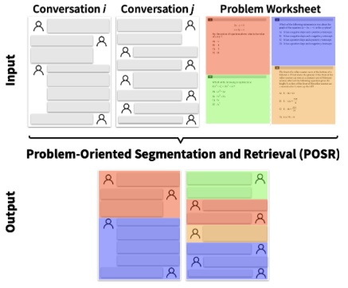

# Problem-Oriented Segmentation and Retrieval

**EMNLP 2024 Findings**

Authors: Rose E. Wang, Pawan Wirawarn, Kenny Lam, Omar Khattab, Dorottya Demszky

[Paper](https://aclanthology.org/2024.findings-emnlp.740/) | [Dataset](#dataset) | [Video](https://www.youtube.com/watch?v=7brgJyDYvio)

**Main Idea: We introduce Problem-Oriented Segmentation and Retrieval (POSR), the task of jointly segmenting conversations and retrieving reference materials (e.g. worksheet problems) discussed in each segment.**

<center>
    
</center>


## Abstract 
Many open-ended conversations (e.g., tutoring lessons or business meetings) revolve around pre-defined reference materials, like worksheets or meeting bullets. To provide a framework for studying such conversation structure, we introduce Problem-Oriented Segmentation & Retrieval (POSR), the task of jointly breaking down conversations into segments and linking each segment to the relevant reference item. As a case study, we apply POSR to education where effectively structuring lessons around problems is critical yet difficult. We present LessonLink, the first dataset of real-world tutoring lessons, featuring 3,500 segments, spanning 24,300 minutes of instruction and linked to 116 SAT math problems. We define and evaluate several joint and independent approaches for POSR, including segmentation (e.g., TextTiling), retrieval (e.g., ColBERT), and large language models (LLMs) methods. Our results highlight that modeling POSR as one joint task is essential: POSR methods outperform independent segmentation and retrieval pipelines by up to +76% on joint metrics and surpass traditional segmentation methods by up to +78% on segmentation metrics. We demonstrate POSR's practical impact on downstream education applications, deriving new insights on the language and time use in real-world lesson structures.

## 📖 Table of Contents 
[**1. Dataset**](#dataset)  
[**2. Replication**](#replication)  
[**3. Citation**](#citation)


## Dataset 

Our dataset contains 3,500 segments of real-world tutoring lessons, spanning 400 hours of instruction and linked to 116 SAT® math problems. 

The tutoring transcripts are located under `data/transcripts/`. The structure of each row in a transcript is as follows:

```
'problem_set': problem set discussed in the tutoring session
'text': utterance
'startTimestamp': utterance start time
'endTimestamp': utterance end time
'speaker': tutor or student
'actual_segment': segment ID
'actual_question_id': ID of problem discussed in segment. If there is no problem discussed (e.g., small talk) then this is empty. If the problem is not found in the worksheet(s), then it is -1.
```

The math problems are located under `data/ocr/`, which contains the OCR version of the problems from each problem set.

## Replication

To run and evaluate all our independent segmentation, independent retrieval, and joint segmentation and retrieval methods, you'll need to install the required packages. You can do this by running the following command:

```
pip install -r requirements.txt
```

We have already ran the methods and saved the predictions and evaluation summaries in `results.zip`. You can download and can unzip the file and view the results with `unzip results.zip`: 

Link: https://drive.google.com/file/d/1gcOKIgZa2yGwzhgrd7pXwTcGV_NW9aXn/view?usp=share_link

### If you want to run the methods individually:

The command template is: 

```
python3 scripts/run.py --task=[segmentation/retrieval/segmentation_and_retrieval] --method=[method] --run_evaluation
```

For example to run the TextTiling segmentation method:

```
python3 scripts/run.py --task=segmentation --method=texttiling --run_evaluation
```

### If you want to run all the methods and evaluate them:

You can run the following command which will run all the methods and evaluate them:

```
sh run.sh
```

The predictions will be saved under `results/[task]/[method]/transcripts/[transcript_id].csv`, and the evaluation summaries will be saved under `results/[task]/[method]/results.txt`. 


## Citation

If you find our work or dataset useful, please consider citing it!

```
@inproceedings{wang-etal-2024-problem,
    title = "Problem-Oriented Segmentation and Retrieval: Case Study on Tutoring Conversations",
    author = "Wang, Rose E  and
      Wirawarn, Pawan  and
      Lam, Kenny  and
      Khattab, Omar  and
      Demszky, Dorottya",
    editor = "Al-Onaizan, Yaser  and
      Bansal, Mohit  and
      Chen, Yun-Nung",
    booktitle = "Findings of the Association for Computational Linguistics: EMNLP 2024",
    month = nov,
    year = "2024",
    address = "Miami, Florida, USA",
    publisher = "Association for Computational Linguistics",
    url = "https://aclanthology.org/2024.findings-emnlp.740",
    pages = "12654--12672",
    abstract = "Many open-ended conversations (e.g., tutoring lessons or business meetings) revolve around pre-defined reference materials, like worksheets or meeting bullets. To provide a framework for studying such conversation structure, we introduce *Problem-Oriented Segmentation {\&} Retrieval (POSR), the task of jointly breaking down conversations into segments and linking each segment to the relevant reference item. As a case study, we apply POSR to education where effectively structuring lessons around problems is critical yet difficult. We present *LessonLink*, the first dataset of real-world tutoring lessons, featuring 3,500 segments, spanning 24,300 minutes of instruction and linked to 116 SAT Math problems. We define and evaluate several joint and independent approaches for POSR, including segmentation (e.g., TextTiling), retrieval (e.g., ColBERT), and large language models (LLMs) methods. Our results highlight that modeling POSR as one joint task is essential: POSR methods outperform independent segmentation and retrieval pipelines by up to +76{\%} on joint metrics and surpass traditional segmentation methods by up to +78{\%} on segmentation metrics. We demonstrate POSR{'}s practical impact on downstream education applications, deriving new insights on the language and time use in real-world lesson structures.",
}
```

